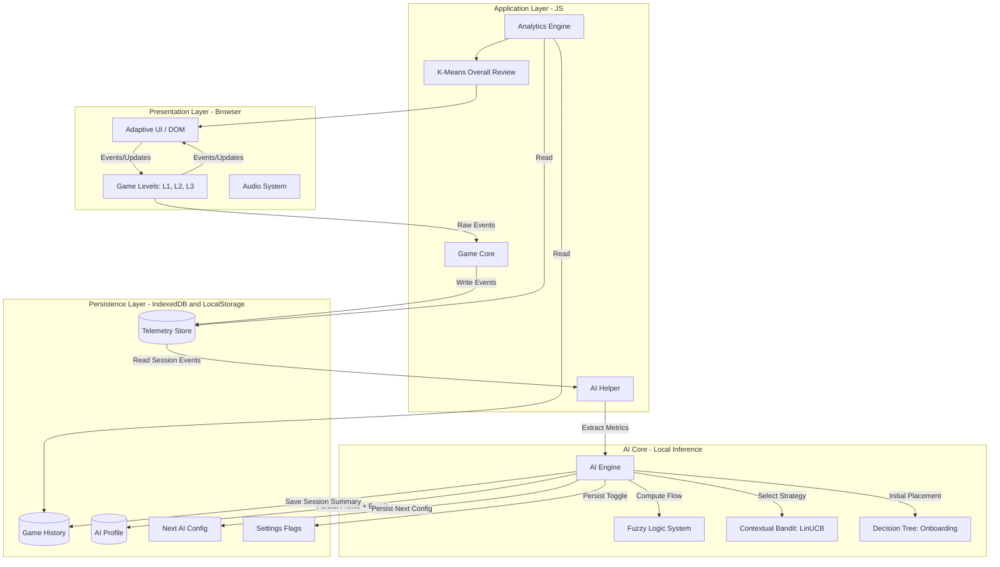
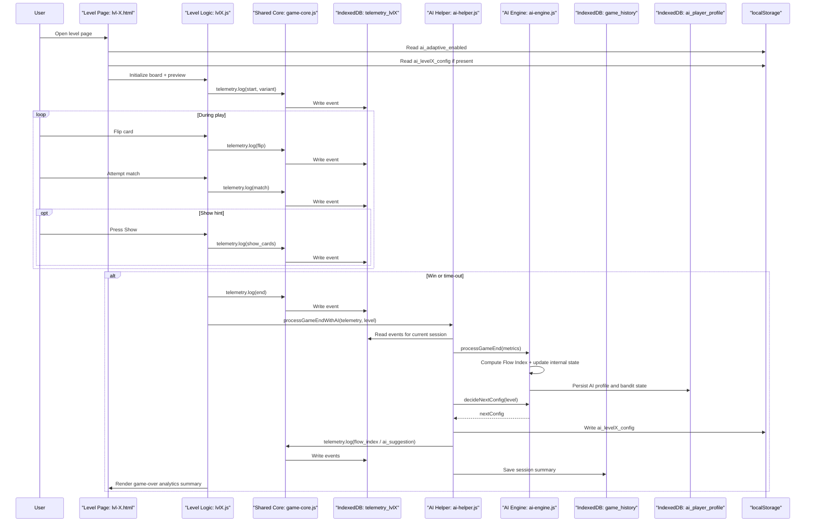
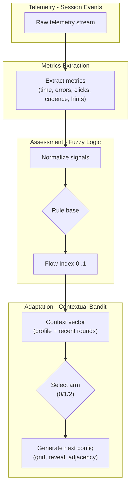
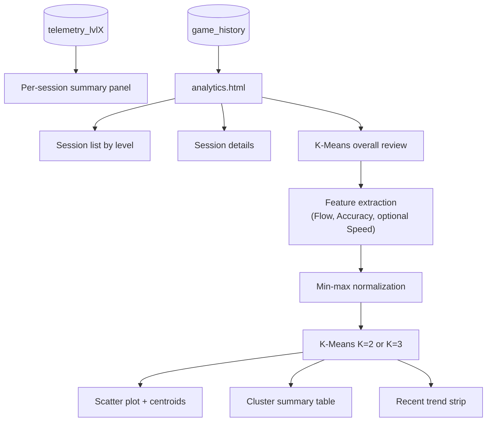
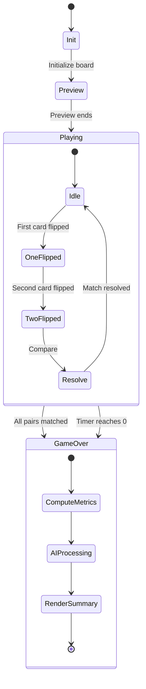
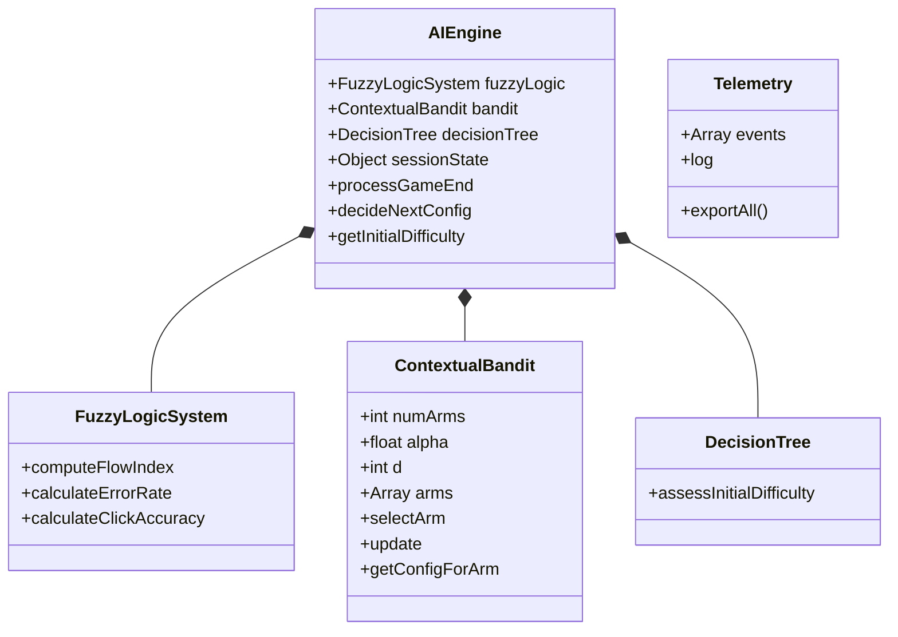
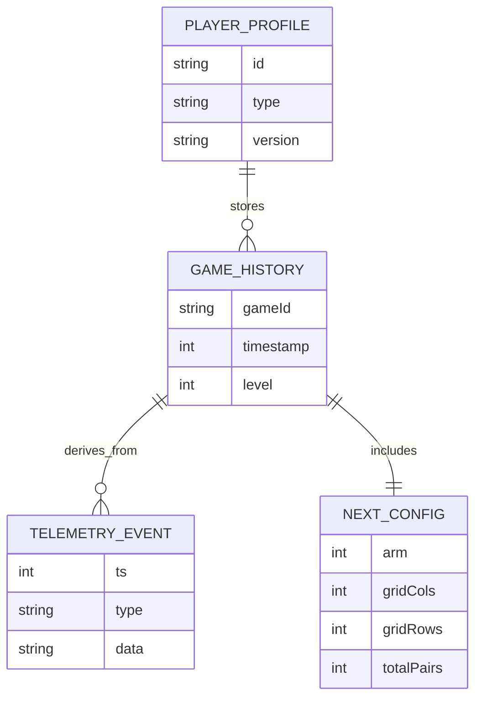

# System Diagrams

This document contains visual representations of the He Maumahara system architecture, gameplay lifecycle, AI workflow, analytics pipeline, and local persistence model. All diagrams are written in Mermaid.js syntax.

**Version**: v3.0.1  
**Date**: 2026-01-15

## 1. High-Level System Architecture

---

## 2. Gameplay Lifecycle (End-to-End)

---

## 3. AI Algorithm Flow (Assessment + Adaptation)

---

## 4. Analytics Pipeline (History + Overall Review)

---

## 5. Game State Machine (Per Round)

---

## 6. Class Structure (Implementation-Oriented)

---

## 7. Data Entity Relationship (ERD)

