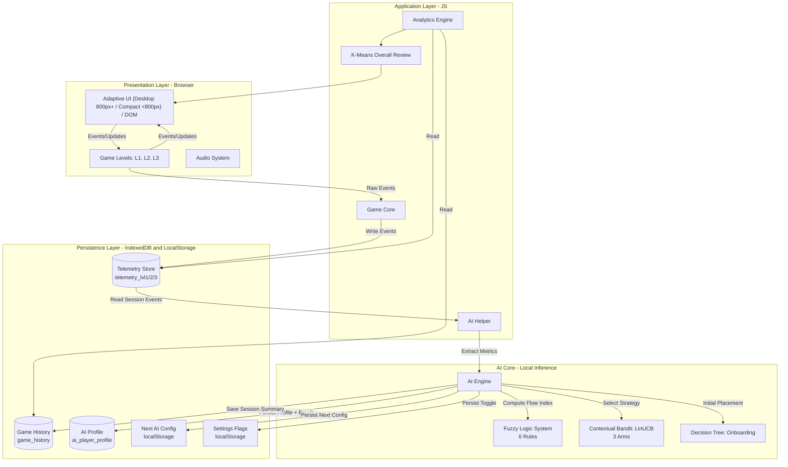
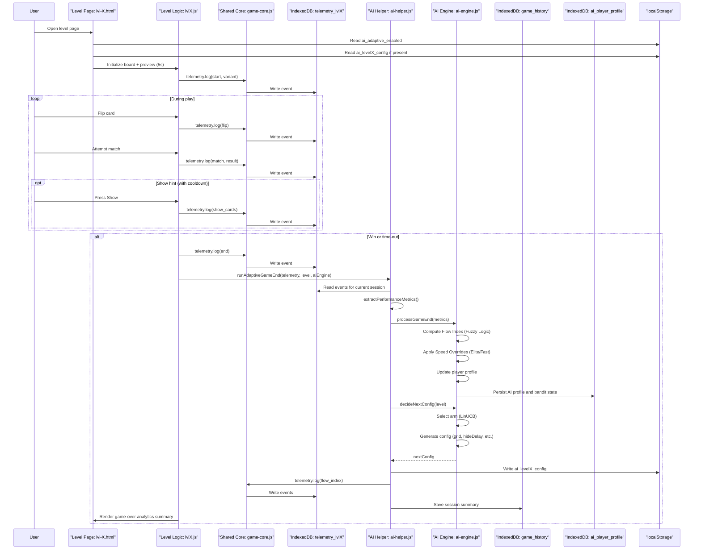
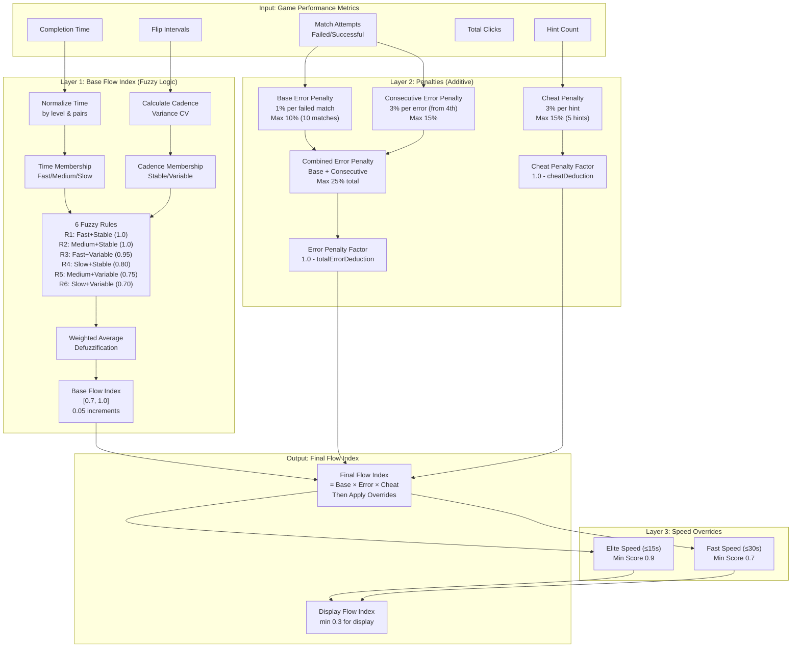
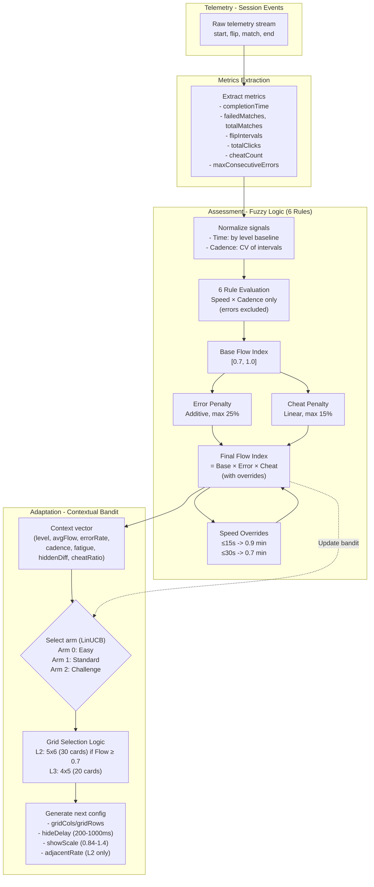
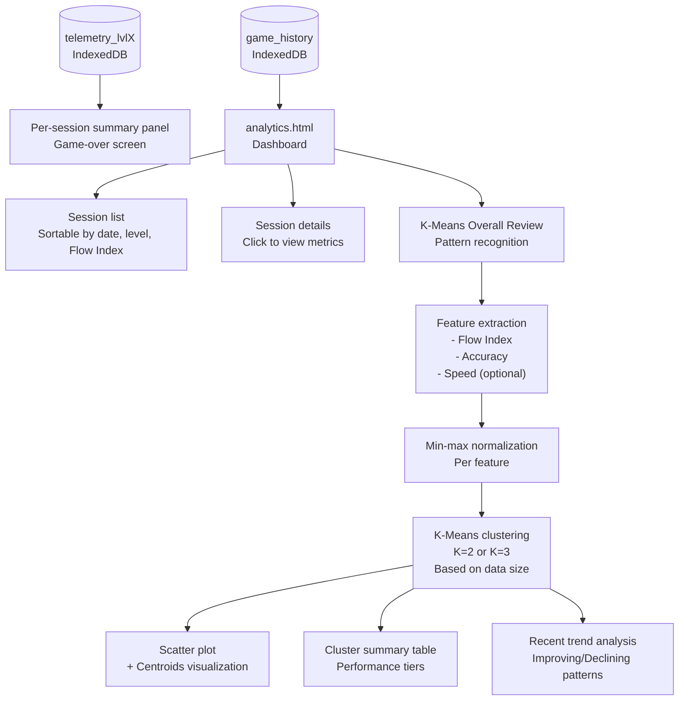
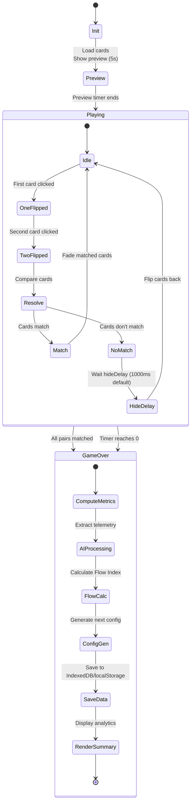
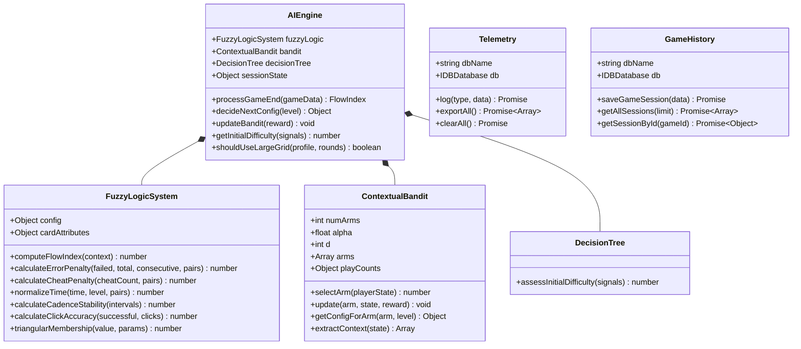
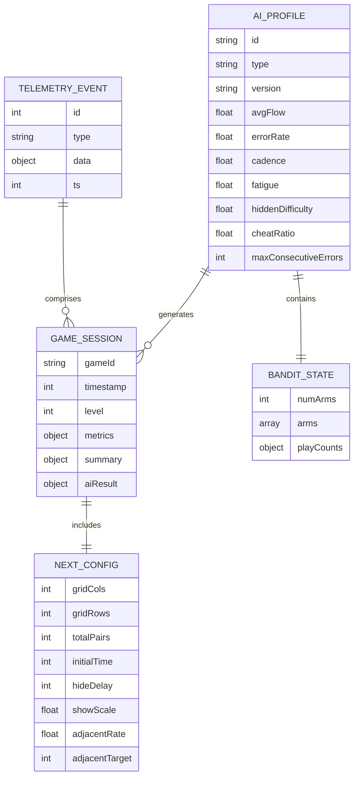
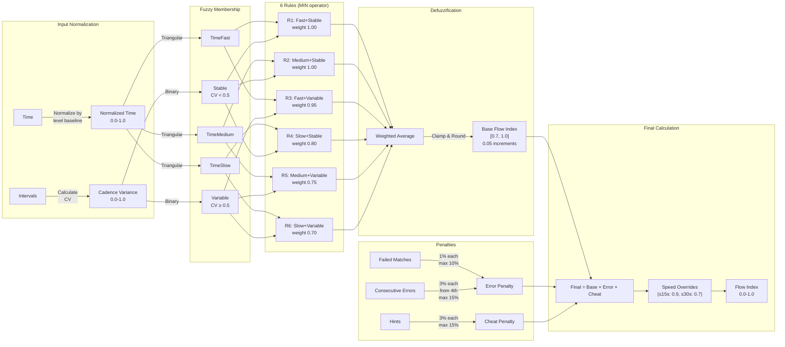
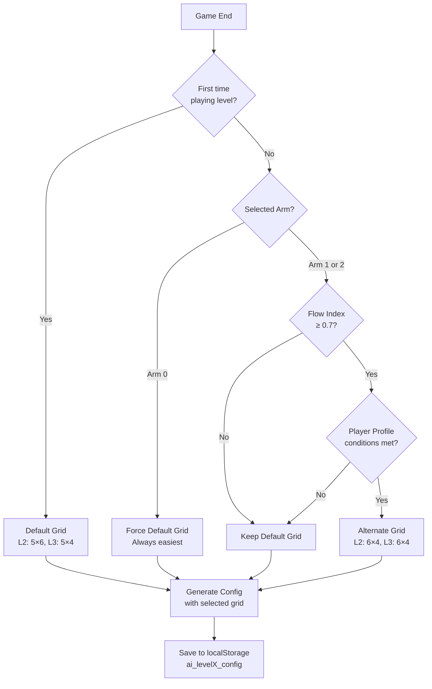

# System Diagrams

This document contains visual representations of the He Maumahara system architecture, gameplay lifecycle, AI workflow, analytics pipeline, and local persistence model. All diagrams are written in Mermaid.js syntax.

**Version**: v4.1.0  
**Date**: 2026-01-25

---

## 1. High-Level System Architecture

---

## 2. Gameplay Lifecycle (End-to-End)

---

## 3. Flow Index Calculation Flow (Three-Layer System)

---

## 4. AI Algorithm Flow (Assessment + Adaptation)

---

## 5. Analytics Pipeline (History + Overall Review)

---

## 6. Game State Machine (Per Round)

---

## 7. Class Structure (Implementation-Oriented)

---

## 8. Data Entity Relationship (ERD)

---

## 9. Flow Index Calculation Detailed Flow

---

## 10. Grid Selection Logic (Level 2 & 3)

---

**Version**: v4.1.0  
**Last Updated**: 2026-01-25
