# System Diagrams

This document contains visual representations of the **He Maumahara** system architecture, AI workflows, and data logic using Mermaid.js syntax.

**Version**: v3.0.0 (2026-01-13)

## 1. High-Level System Architecture

The system follows a **Zero-Data-Exfiltration** architecture where all AI processing happens locally in the browser.

---

## 2. AI Algorithm Flow (The Brain)

This diagram details how the system converts raw gameplay metrics into a specific game configuration for the next round.

---

## 3. Analytics Clustering Flow (K-Means Overall Review)

This diagram shows how the Analytics page generates an unsupervised clustering summary from local game history.

```mermaid
flowchart TD
    HistDB[(game_history)]
    Page["analytics.html"]
    Summary["renderKMeansOverallEvaluation()"]
    Features["Feature extraction\n(Flow, Accuracy, Speed)"]
    Norm["Min-max normalization"]
    Model["K-Means\n(K=2 or 3)"]
    Viz["Lightweight SVG\n(scatter + centroids)"]
    Table["Cluster summary table\n(mean ± std dev)"]
    Trend["Recent trend strip\n(last ~10)"]

    Page --> Summary
    Summary --> HistDB
    HistDB --> Features
    Features --> Norm
    Norm --> Model
    Model --> Viz
    Model --> Table
    Model --> Trend
    Viz --> Page
    Table --> Page
    Trend --> Page
```

---

## 3. Game State Machine

Represents the valid states and transitions within a game session.

---

## 4. Game Lifecycle Sequence

Detailed sequence of API calls during a complete game loop.

---

## 5. Class Structure (Updated)

Key classes and their relationships in the codebase.

## 6. Data Entity Relationship (ERD)

Structure of the data stored in the browser.

